**Nama  : Ahmad Tito N.H  
  Kls   : TI-3G  
  NIM   : 2141720265   **

Tugas 1   
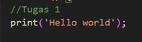 
Output 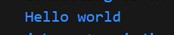
 
Penjelasan: Dari kode program diatas menghasilkan output menampilkan sebuah tulisan "Hello World"   
Tugas 2   
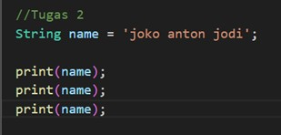 
Output 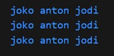
 
Penjelasan: Dari kode program diatas menghasilkan output menampilkan nama lengkap 3 kali berturut   
Tugas 3   
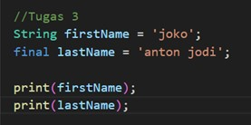 
Output 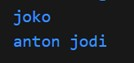
 
Penjelasan: Kode program digunakan untuk mendeklarasikan dan mencetak dua string, dengan firstName yang dapat diubah nilainya dan lastName yang memiliki nilai tetap (final)   
Tugas 4.1   
.jpg) 
Output  .jpg)
 
Penjelasan: Kode program tersebut menghasilkan output error 
Perbaikan .jpg) 
.jpg)  
Tugas 4.2   
.jpg) 
Output .jpg)
 
Penjelasan: Kode program digunakan untuk mendeklarasikan dan mencetak dua jenis variabel numerik, yaitu integer (number1) dan double (number2).  
Tugas 5   
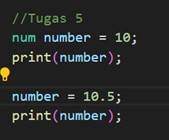 
Output 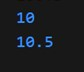
 
Penjelasan:  Kode program tersebut menghasilkan output 2 angka berbeda, yaitu integer (number1) dan double (number2).  
Tugas 6   
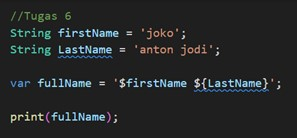 
Output 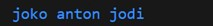
 
Penjelasan: Kode program tersebut menghasilkan output fullname, yang terdiri dari firstName dan lastName.  
Tugas 7   
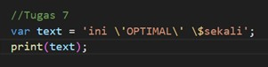 
Output 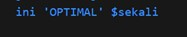
 
Penjelasan: Kode program tersebut menghasilkan output sebuah teks.  
Tugas 8   
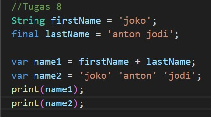 
Output 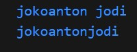
 
Penjelasan: Kode program tersebut menghasilkan output sebuah name, yang terdiri dari name1 dan name2.  
Tugas 9   
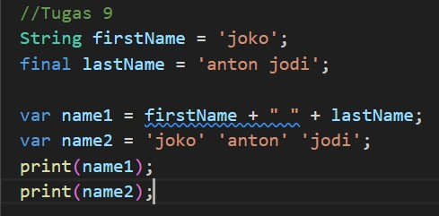 
Output 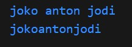
 
Penjelasan: Dari kode program diatas menghasilkan output name, yaitu name1 dan name2.  
Tugas 10   
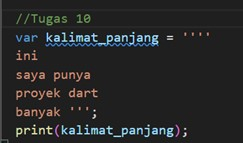 
Output 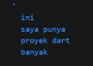
 
Penjelasan: Kode program diatas menghasilkan output sebuah kalimat.  
